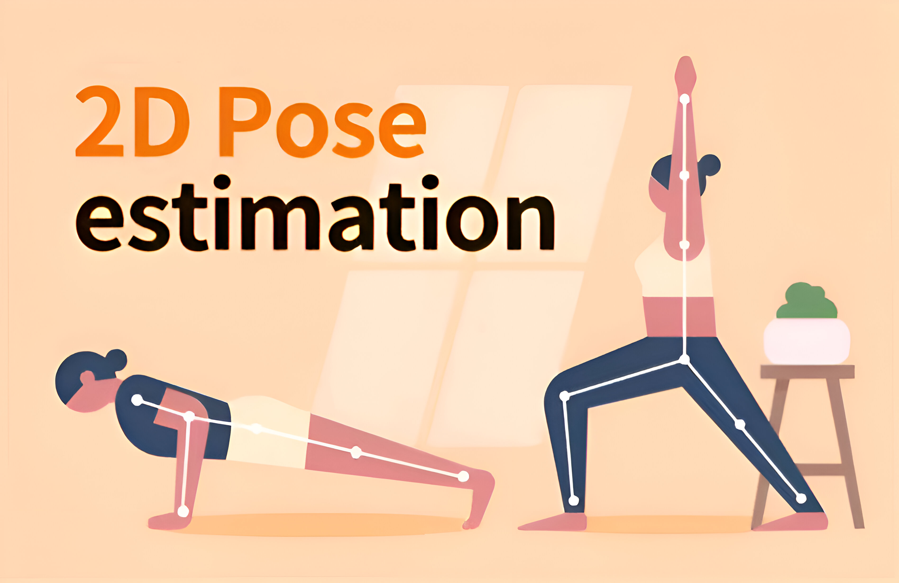
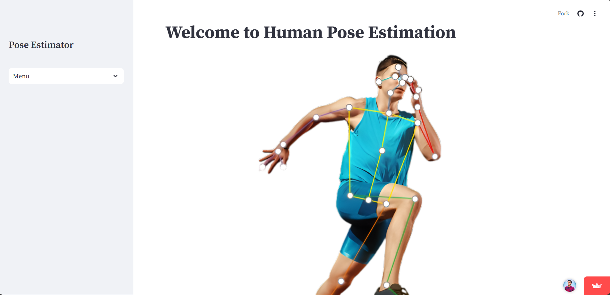
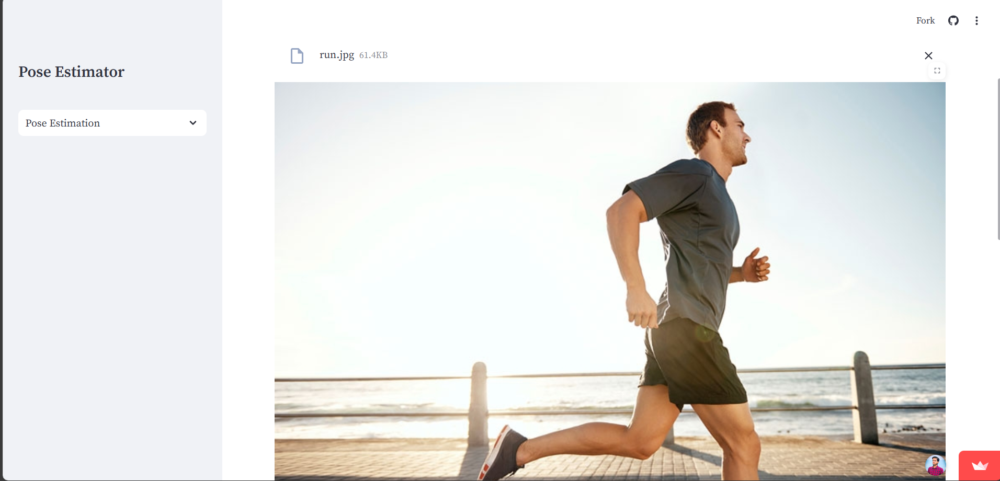
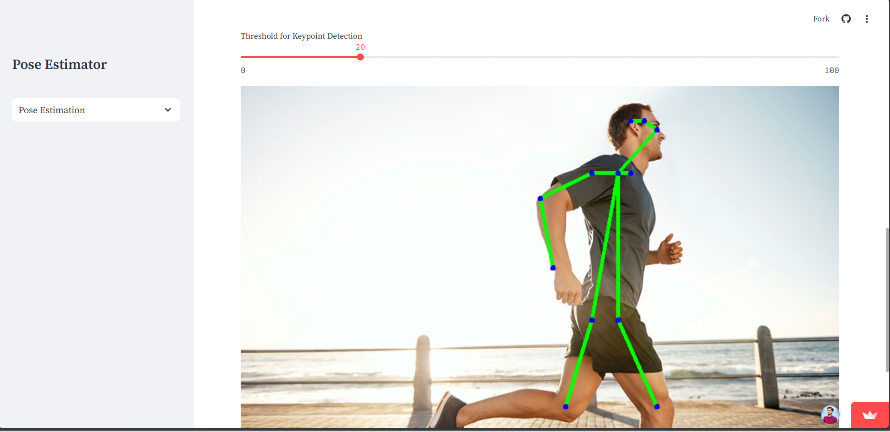
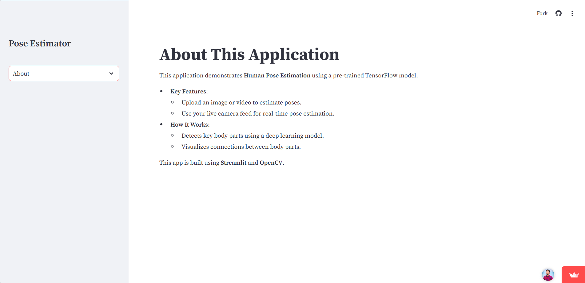
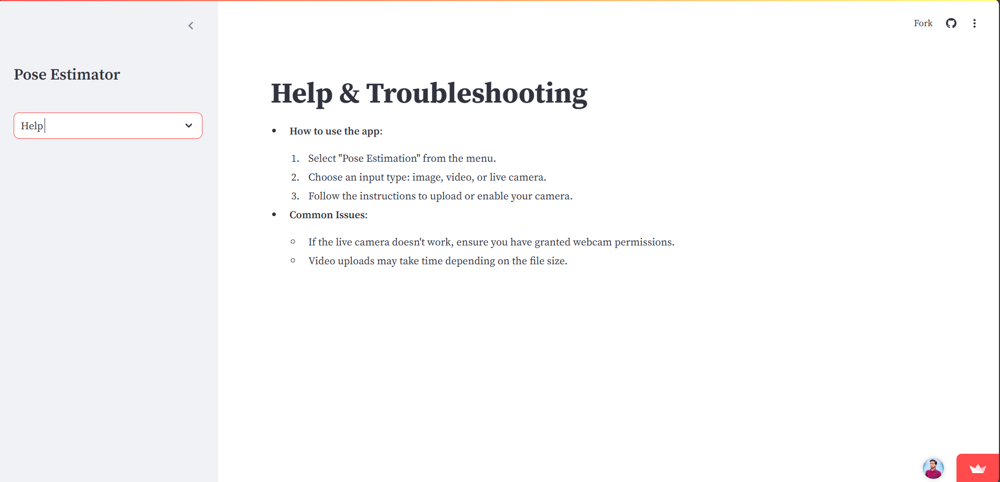

# Human Pose Estimation with Streamlit and OpenCV


<div align="center">
  
</div>

## 📋 Table of Contents

- [About the Project](#about-the-project)
- [✨ Features](#✨-features)
- [🚀 Installation](#🚀-installation)
- [💻 Usage](#💻-usage)
- [🛠️ Technologies Used](#🛠️-technologies-used)
- [📸 Screenshots](#📸-screenshots)
- [🤝 Contributing](#🤝-contributing)
- [📜 License](#📜-license)
- [📞 Contact](#📞-contact)


---

## About the Project
This project is an interactive web application for **real-time human pose estimation**, leveraging **OpenCV**, **TensorFlow**, and **Streamlit**. It detects human body key points in images, videos, and live camera feeds, visualizing them in real time.

---

## ✨ Features
- Upload an image or video for pose estimation.
- Real-time pose detection using your webcam.
- Visualize body parts and connections.
- Clean and user-friendly interface with a responsive sidebar.

---

## 🚀 Installation
1. Clone the repository:
   ```bash
   git clone https://github.com/Wani-Chetan-999/Human-Pose-Estimation.git
   cd Human-Pose-Estimation
   ```
2. Create a virtual environment and activate it:
   ```bash
   python -m venv env
   source env/bin/activate  # On Windows: .\env\Scripts\activate
   ```
3. Install the required dependencies:
   ```bash
   pip install -r requirements.txt
   ```
4. Run the application:
   ```bash
   streamlit run app.py
   ```

---

## 💻 Usage
1. Navigate to `http://localhost:8501` after starting the app.
2. Use the **sidebar** to:
   - Select tabs like Home, Pose Estimation, About, and Help.
   - Choose between uploading images/videos or using the live camera.
3. View real-time pose estimations on the uploaded content.

---

## 🛠️ Technologies Used
- **Streamlit**: For the interactive web app interface.
- **OpenCV**: For image processing and pose estimation.
- **TensorFlow**: For the pre-trained model.
- **Python**: Backend development and integration.

---

## 📸 Screenshots
### Home Page
<div align="center">
  
</div>

### Pose Estimation Input (Image/Video/Live Cam)
<div align="center">
  
</div>

### Pose Estimation Input (Image/Video/Live Cam)
<div align="center">
  
</div>

### Pose Estimation Output
<div align="center">
  
</div>

### About Page
<div align="center">
  
</div>

### Help Estimation in Action
<div align="center">
  
</div>
---

## 🤝 Contributing
Contributions are welcome! Please follow these steps:
1. Fork the repository.
2. Create a new branch:
   ```bash
   git checkout -b feature/YourFeature
   ```
3. Commit your changes:
   ```bash
   git commit -m "Add your message here"
   ```
4. Push to your branch:
   ```bash
   git push origin feature/YourFeature
   ```
5. Open a pull request.

---

## 📜 License
This project is licensed under the **MIT License**. See the [LICENSE](LICENSE) file for details.

---

## 📞 Contact
- **Name**: Chetan Wani  
- **Email**: [02ckwani@gmail.com](mailto:your-email@example.com)  
- **GitHub**: [Wani-Chetan-999](https://github.com/Wani-Chetan-999)  
- **LinkedIn**: [www.linkedin.com/in/chetan-kailas-wani/](https://www.linkedin.com/in/your-profile/)  


### Steps:
1. Replace placeholder texts (e.g., `your-email@example.com`, `Your LinkedIn Profile`) with your actual details.
2. Add project-specific images/screenshots where indicated.
3. Save this as `README.md` in the root of your project folder.

Let me know if you'd like further assistance! 😊
